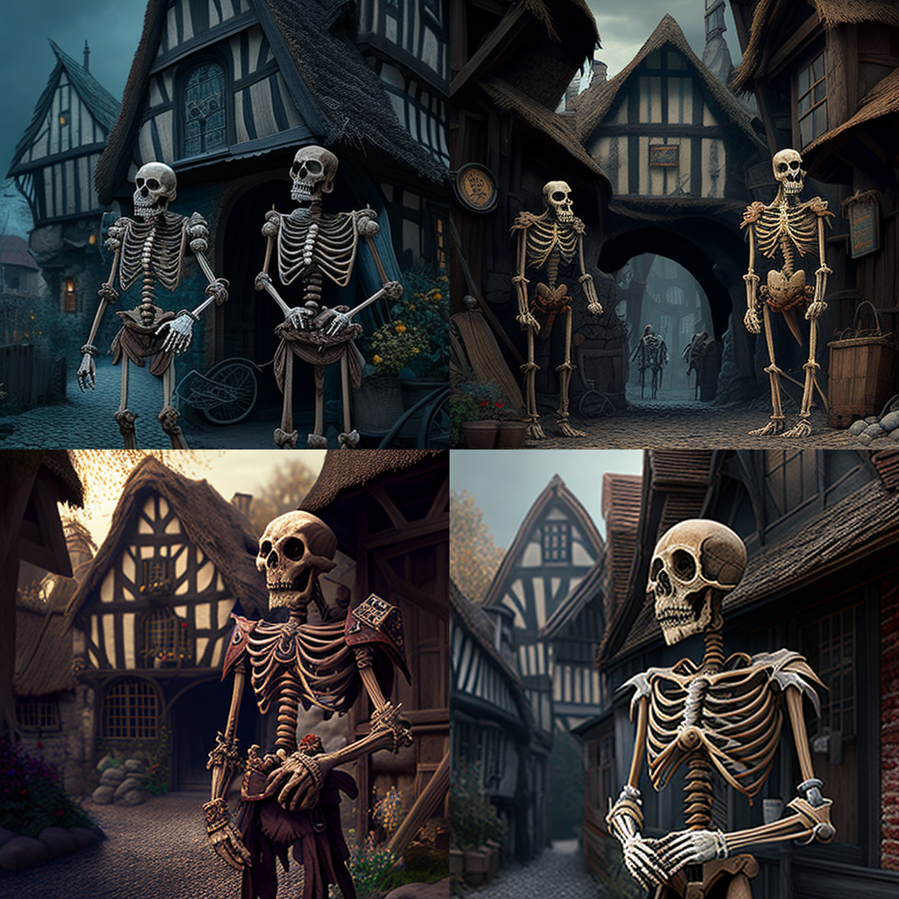
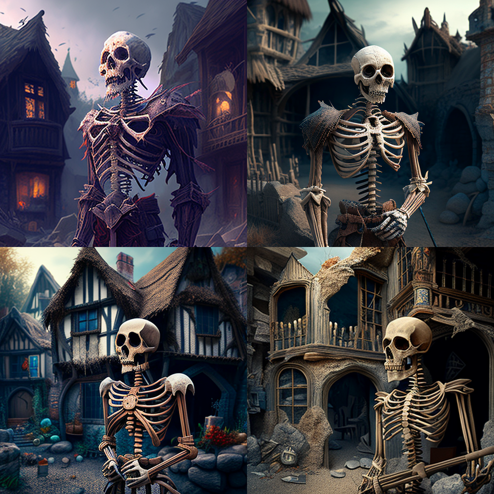
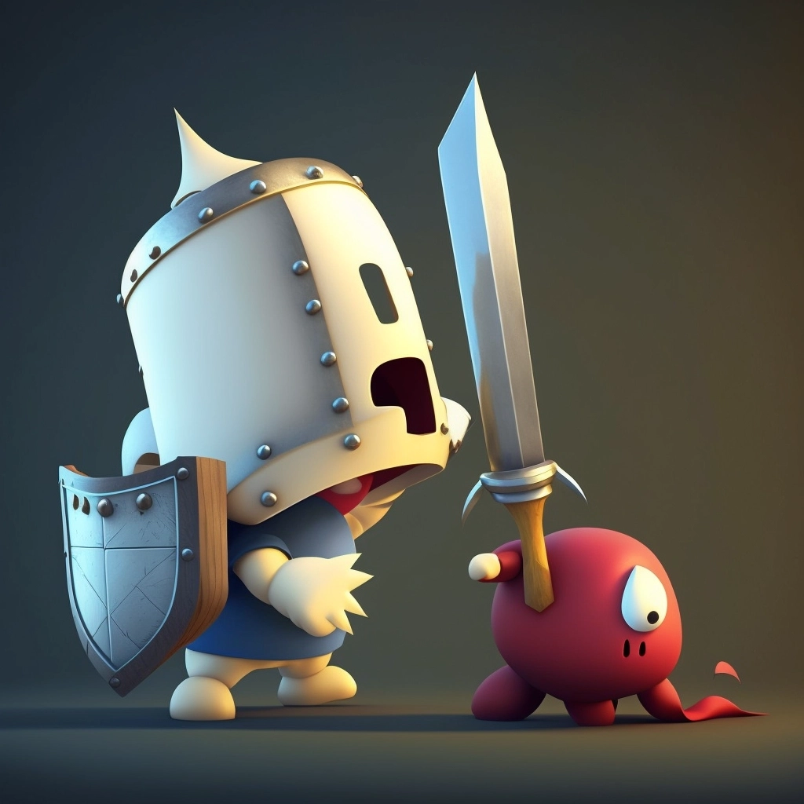
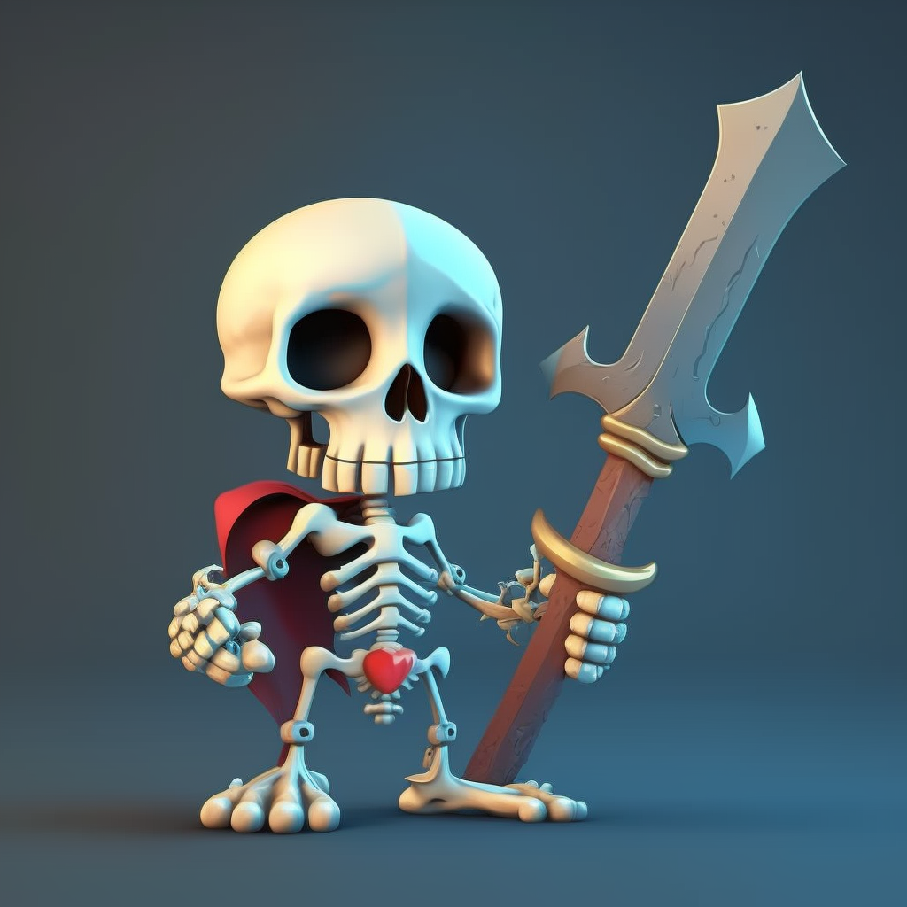

# Game design document for [RunKing](https://github.com/dimbodek/RunKing "RunKing game repo") game

## Table of contents
* [Table of contents](#table_of_contents)
* [Introduction](#introduction)
* [Narrative](#narrative)
* [Gameplay](#gameplay)
* Characters (in process...)
* Interface (in process...)
* Features  (in process...)
* Analytics (in process...)

## Introduction
May be bryfly described as gybrid of [Subway Surfers](https://play.google.com/store/apps/details?id=com.kiloo.subwaysurf&hl=ru&gl=US) and [Join Clash 3D](https://play.google.com/store/apps/details?id=com.freeplay.runandfight&hl=en_US&gl=US) by mechanics

it's a hyper-casual mobile game based on runner mechanic where user must controll group of character which infinity move forward and move it from on corner to another one to avoid obstacls or collect smth. This game mostly targen on children from 6+ y.o. Game must be maked in casual design style in mediaeval-fantasy setting.

***

## Narrative
Game events happened in mediaeval-fantasy kigdom which are captured by skeletons, they destroyed most buildings and take in jail all knights defenders. We can see on locations that they are captured, buildings destroyed, fields are in fiere and a lot of skeletons around on background. There are several bosse's which controlls skelletons, player may sometimes meet them on a road, he can't kill them or attack, he only can avoid their attacks. Player will be fight with regular skeletons when collide and free up caused knights to extend his army, also player may loose knights when fight with skeletons or collide with obstacls or bosse's attacks. During the run player can collect gold for different activity and then spend them in the store. As game is infinity player can achive score for run and make records.

***

## Gameplay
Game(run) starts from single knight under player controll which move forward on straight road. On road player can meet next types of entities: skeletons squads, coins, obstacls and boosts. With each of entity player can collide or not. 
* When collide with skeletons sqaud player loose his knights in quantity equal skeletons, so if knights under player controll less then count of skeletons - game over, in another way player recive gold from skeletons squad and captured knights if they exist. 
* When collide with coin player just collect it.
* When collide with obstacl player loose knight wich collide.
* When collide with boost, player apply it

Player can only move knights under his controll from one side of road to another.
Game speed is increase during time.

***

## Entities

### Knight 

Knight is protogonist entity type. For game gonne always must be least one knight under player controll. Player can collect them and loose when collider with enemys entitys.

&nbsp;

&nbsp;

&nbsp;

&nbsp;

&nbsp;

&nbsp;

### Skeleton

Skeleton is a type of enemy entity. He kills the knight upon confronting him and dies from the knight's attack. The player can meet him and fight him or run around him.
