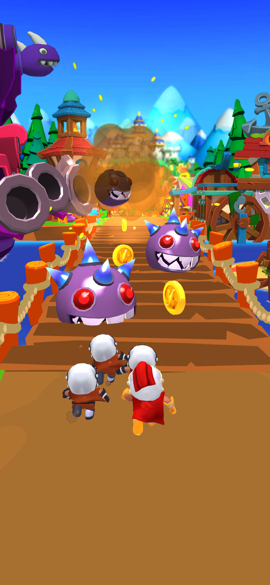
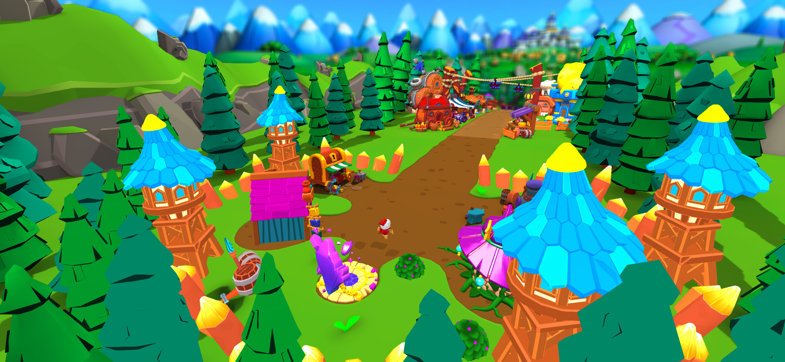
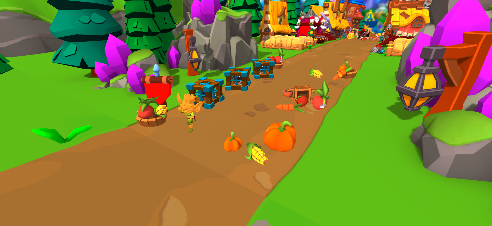
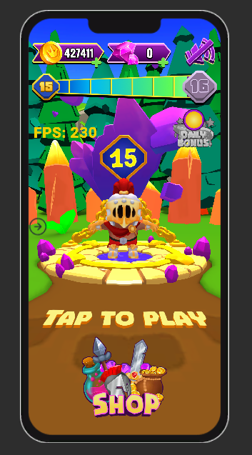
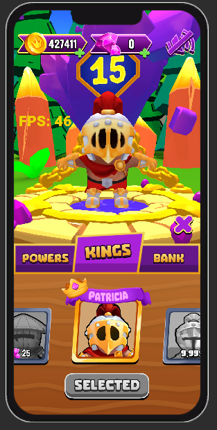
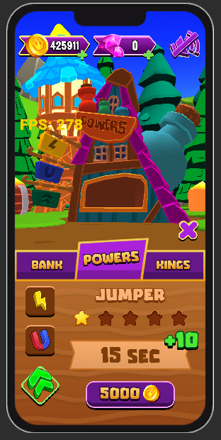

# **Game Design Document (GDD) – [RNK]**

## **Table of Contents**
1. [Game Overview](#game-overview)
2. [Core Gameplay](#core-gameplay)
3. [Game World & Level Structure](#game-world--level-structure)
4. [Goblin Behavior](#goblin-behavior)
5. [Boosters](#boosters)
6. [User Interface & Navigation](#user-interface--navigation)
7. [Store & Progression](#store--progression)
8. [Level Generation & Difficulty Scaling](#level-generation--difficulty-scaling)

---

## **Game Overview**
- **Genre:** Endless Runner with Squad Mechanics  
- **Platform:** Mobile (iOS, Android)  
- **Art Style:** 3D, colorful, medieval-fantasy theme  
- **Game Loop:**
  1. Navigate the **3D menu world** to access different sections (Store, Bank, etc.).
  2. Press **Play** → the camera rotates behind the player, and the run begins.
  3. **Dodge traps, collect coins, fight goblins, and grow your squad** while progressing.
  4. **Rescue units** to maintain squad size.

---

## **Core Gameplay**

- **Controls:**
  - **Swipe left/right** – Moves the entire squad left or right (smooth X-axis movement).
  - The player **cannot jump or slide** (since the squad consists of multiple units).
- **Main Objectives:**
  - Avoid **traps** to prevent unit loss.
  - **Collect coins** and **boosters** for advantages.
  - Enter **goblin camps** to fight, rescue units, and progress further.
  - If the player has **no units left and collides with a goblin, they die**.

---

## **Game World & Level Structure**

The game world is procedurally generated with **randomly spawned locations**.
- **Long Locations**
  - Focus on **avoiding traps and collecting coins**.
  - Losing units in traps reduces the player's squad.
- **Short Locations (Goblin Camps)**
  - Players must **fight goblins using their units**.
  - **Free new units from cages** to restore squad size.
  - If the player **has no units left**, they will **die if they hit a goblin**.

---

## **Goblin Behavior**

- Goblins **only appear in camps**, which also contain cages and props that can be destroyed for visual effects.  
- If the **player has more than one unit**, the **front unit automatically attacks goblins** and both are removed from play (unit dies, goblin dies).  
- If the **player has only one unit left**, it **won't attack**. The player must either:  
  - **Rescue new units from cages** before reaching the goblins.  
  - **Avoid goblins completely** (if possible).  
- If the **player collides with a goblin while alone**, they **lose the game**.

---

## **Boosters**

Boosters replace some coin spawns and provide temporary benefits:
1. **Jumper** – Makes the group **jump over obstacles**, skipping a short section of the level.
2. **Score Booster** – **Increases score multiplier** and **boosts speed**.
3. **Magnet** – **Attracts nearby coins** to the player's units.

---

## **User Interface & Navigation**

- **3D Menu System** (No traditional UI screens)
  - All menu sections exist in **3D space** inside a **friendly camp**.
  - The **camera smoothly rotates** to different sections instead of using loading screens.
  - Example: Selecting the **store** moves the camera to a **golden treasure chest** in the camp.
- **Seamless Transition into Gameplay**
  - Pressing **Play** rotates the camera behind the player.
  - The **player starts running from the menu position**, smoothly transitioning into gameplay.

---

## **Store & Progression**

- **How Players Earn Coins:**
  - **During runs** – Collecting coins along the road.
  - **Daily Bonus in the Menu** – Free coins given daily.
- **What Coins Are Used For:**
  - **Upgrading Boosters** – Making them last longer or work better.
  - **Buying New Skins** – Customizing character appearance.
  - **Unlocking New Playable Characters** – Getting unique heroes.

---

## **Level Generation & Difficulty Scaling**

- **Random Level Part Sequence**  
  - Levels **spawn in a random order**, but ensure that **all unique level parts appear at least once per cycle** before repeating.  
- **Trap Activation Control**  
  - If a trap was **disabled in the last sequence**, the system **tries to enable a different trap** in the next one.  
  - This prevents repetitive patterns and keeps gameplay fresh.  
- **Difficulty Scaling Over Time**  
  - **Speed Increases** – The player moves faster the longer they survive.  
  - **Trap Speed Increases** – Traps animate and reset more quickly.  
  - **More Reaction-Based Gameplay** – Faster speeds make dodging and squad management harder.  

---

