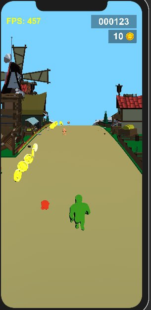

# Game design document for [RunKing](https://github.com/dimbodek/RunKing "RunKing game repo") game

## Table of contents
* [Table of contents](#table_of_contents)
* [Introduction](#introduction)
* [Narrative](#narrative)
* [Gameplay](#gameplay)
* Characters (in process...)
* Interface (in process...)
* Features  (in process...)
* Analytics (in process...)

## Introduction
May be bryfly described as gybrid of [Subway Surfers](https://play.google.com/store/apps/details?id=com.kiloo.subwaysurf&hl=ru&gl=US) and [Join Clash 3D](https://play.google.com/store/apps/details?id=com.freeplay.runandfight&hl=en_US&gl=US) by mechanics

it's a hyper-casual mobile game based on runner mechanic where user must controll group of character which infinity move forward and move it from on corner to another one to avoid obstacls or collect smth. This game mostly targen on children from 6+ y.o. Game must be maked in casual design style in mediaeval-fantasy setting.

***

## Narrative
Game events happened in mediaeval-fantasy kigdom which are captured by skeletons, they destroyed most buildings and take in jail all knights defenders. We can see on locations that they are captured, buildings destroyed, fields are in fiere and a lot of skeletons around on background. There are several bosse's which controlls skelletons, player may sometimes meet them on a road, he can't kill them or attack, he only can avoid their attacks. Player will be fight with regular skeletons when collide and free up caused knights to extend his army, also player may loose knights when fight with skeletons or collide with obstacls or bosse's attacks. During the run player can collect gold for different activity and then spend them in the store. As game is infinity player can achive score for run and make records.

***

## Gameplay
 Game(run) starts from single knight under player controll. Player can add new knights in his group when collide with them. Knights group always move forward, player only have option move group between corners. When knight collide with obstacl or skeleton he die, if no knights is left under player controll - game over. Also player can meet different bosses during run which are apearens on some time and trying to attaks player's knights, player must avoid attacks to save knights. Player should collect coins by collide with them. Knights can be spended on fight with skeletons to free up new knights and collect more gold.

